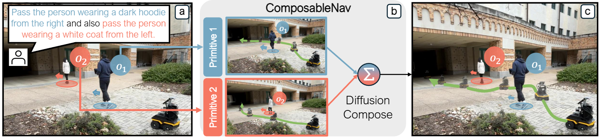

# ComposableNav: Instruction-Following Navigation in Dynamic Environments via Composable Diffusion

**[[Project Page]](https://amrl.cs.utexas.edu/ComposableNav/)**

Zichao Hu, Chen Tang, Michael Munje, Yifeng Zhu, Alex Liu, Shuijing Liu, Garrett Warnell, Peter Stone, Joydeep Biswas

<p align="center">
  
</p>


## 🚀 Environment Setup

1. Clone this repository:
   ```bash
   git clone git@github.com:ut-amrl/ComposableNav.git
   cd ComposableNav
   ```

2. Create and activate the Conda environment:
    ```bash
    conda create --name composablenav_env python=3.10 -y
    conda activate composablenav_env
    ```

3. Install torch:
    ```bash
    pip install torch==2.4.1 --index-url https://download.pytorch.org/whl/cu121
    ```

4. Install dependencies:
    ```bash
    pip install -e .
    ```

## 🧩 Workflow

ComposableNav uses three main stages: **data generation → supervised pre-training → RL fine-tuning**.  
All stages are wrapped in scripts under `scripts/` for reproducibility.

### 1. Data Generation
Generate synthetic, collision-free, and goal-reaching trajectories.
```bash
bash scripts/generate_data.sh 
```
Optional overrides (e.g., number of processes or samples) follow Hydra syntax

### 2. Supervised Pre-training

Train a base diffusion model on generated data:
```bash
bash scripts/supervised_pretrain.sh +data_path=generated_data/pretrain_<datetime> +exp_name=supervised_pretrain
```
Example with multi-GPU:
```bash
bash scripts/supervised_pretrain.sh +data_path=generated_data/pretrain_<datetime> +exp_name=pretrain_2gpu trainer.devices=2
```

### 3. RL Fine-tuning

Fine-tune the base model into individual motion primitives using DDPO:
```bash
bash scripts/rl_finetune.sh +primitive=pass_from_left +exp_name=ft/pass_from_left +checkpoint=training_results/<pretrain_exp_name>/last.ckpt
```

Each primitive (e.g., pass_from_left, follow, yield) is trained with its own rule-based reward.

## 📊 Evaluation & Demo

🚧 **Work in Progress:** Stay tuned for updates!

## 🙏 Acknowledgment

Parts of the diffusion model implementation are adapted from [lucidrains/denoising-diffusion-pytorch](https://github.com/lucidrains/denoising-diffusion-pytorch).

## 📚 Citation

If you find this work useful, please cite:
```
@inproceedings{hu2025composablenav,
  title     = {ComposableNav: Instruction-Following Navigation in Dynamic Environments via Composable Diffusion},
  author    = {Zichao Hu and Chen Tang and Michael Munje and Yifeng Zhu and Alex Liu and Shuijing Liu and Garrett Warnell and Peter Stone and Joydeep Biswas},
  booktitle = {Conference on Robot Learning (CoRL)},
  year      = {2025}
}
```