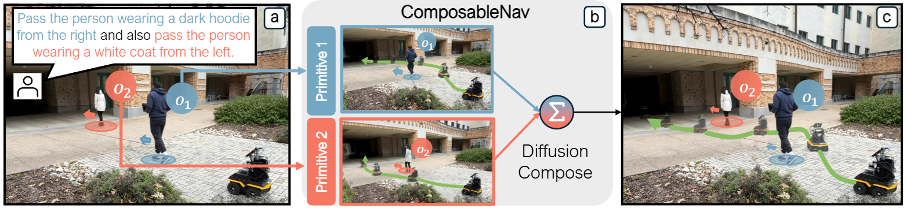

# ComposableNav: Instruction-Following Navigation in Dynamic Environments via Composable Diffusion

**[[Project Page]](https://amrl.cs.utexas.edu/ComposableNav/)**

Zichao Hu, Chen Tang, Michael Munje, Yifeng Zhu, Alex Liu, Shuijing Liu, Garrett Warnell, Peter Stone, Joydeep Biswas

  

---

# In progress — check back soon.