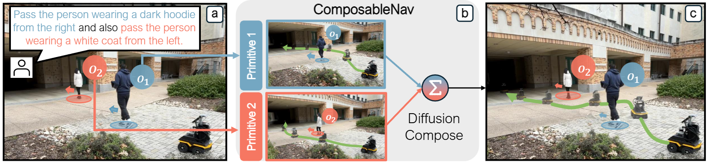
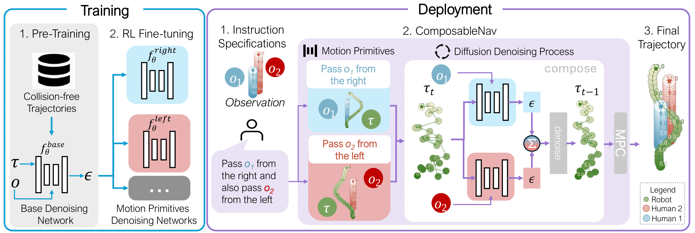
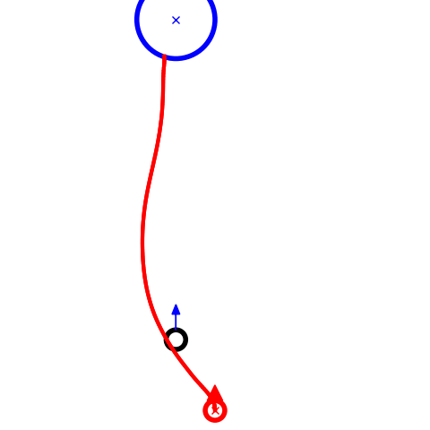
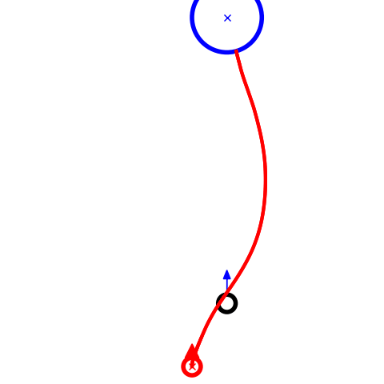
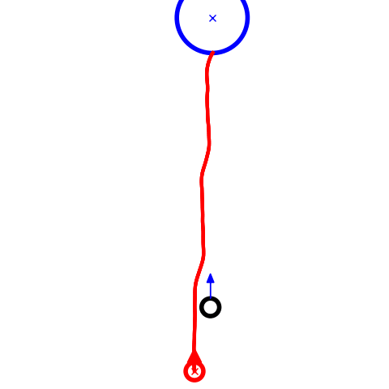
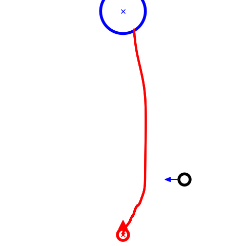
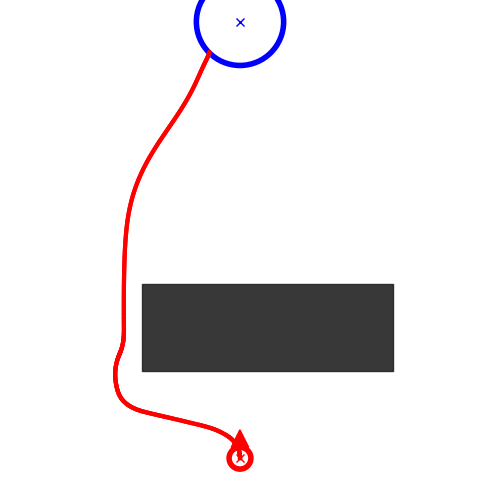

<style>
@import url('https://fonts.googleapis.com/css2?family=Space+Grotesk:wght@500&display=swap');
.curly-font {
    font-family: 'Space Grotesk', cursive;
    color: orange;
}
body {
  font-size: 18px; /* or whatever size you prefer */
}

/* for bib tex */
pre code {
  white-space: pre-wrap;     /* wrap instead of scrolling */
  word-break: break-word;    /* break long words/URLs */
}
.label-box {
  height: 60px;   /* 👈 fixed height for all labels */
  overflow-y: auto;
  line-height: 1.1;   /* smaller = tighter lines */
}
</style>


<div class="text-center">
  <a type="button" class="btn btn-link" style="margin: 5pt 20pt 30pt 20pt; height:40px;" href="https://github.com/ut-amrl/ComposableNav">
    <h5>
       Code
    </h5>
  </a>

  <a role="button" class="btn btn-link" style="margin: 5pt 20pt 30pt 20pt; height:40px;" href="https://www.cs.utexas.edu/~pstone/Papers/bib2html-links/zichao_hu_corl2025.pdf">
    <h5>
       Paper
    </h5>
  </a>

  <a role="button" class="btn btn-link" style="margin: 5pt 20pt 30pt 20pt; height:40px;" href="https://huggingface.co/zichao22/ComposableNav_Models/tree/main">
    <h5>
       Model Checkpoints
    </h5>
  </a>
</div>

<div class="text-center">
  
  Given an instruction that specifies how a robot should interact with entities in the scene (a), ComposableNav leverages
the composability of diffusion models (b) to compose motion primitives to generate instructionfollowing trajectories (c).
</div>

<hr>

# Abstract

This paper considers the problem of enabling robots to navigate dynamic environments while following instructions. The challenge lies in the combinatorial nature of instruction specifications: each instruction can include multiple specifications, and the number of possible specification combinations grows exponentially as the robot’s skill set expands. For example, “pass_from the pedestrian while staying on the right side of the road” consists of two specifications: “pass_from the pedestrian” and “walk on the right side of the road.” To tackle this challenge, we propose ComposableNav, based on the intuition that following an instruction involves independently satisfying its constituent specifications, each corresponding to a distinct motion primitive. Using diffusion models, ComposableNav learns each primitive separately, then composes them in parallel at deployment time to satisfy novel combinations of specifications unseen in training. Additionally, to avoid the onerous need for demonstrations of individual motion primitives, we propose a two-stage training procedure: (1) supervised pre-training to learn a base diffusion model for dynamic navigation, and (2) reinforcement learning fine-tuning that molds the base model into different motion primitives. Through simulation and real-world experiments, we show that ComposableNav enables robots to follow instructions by generating trajectories that satisfy diverse and unseen combinations of specifications, significantly outperforming both noncompositional VLM-based policies and costmap composing baselines. 

<hr>

# ComposableNav
ComposableNav is a diffusion-based planner for instruction-following navigation. ComposableNav first learns motion primitives via a two-stage training procedure. At deployment, given instruction specifications, it selects relevant primitives and composes them by summing the predicted noise from each diffusion model during the denoising process. Finally, for real-time control, ComposableNav is paired with an model predictive controller.

<div class="text-center">
  
</div>
<br>


## Two-Stage Training Procedure 




## Deployment Illustration
<video autoplay loop muted playsinline controls preload="metadata">
  <source src="assets/videos/deployment_illustration.mp4" type="video/mp4"></source>
</video>

<hr>

<div style="background-color: #f5f5f5; padding: 1em 20px 20px 20px">
<!-- padding-left:20px; padding-right:20px; padding-bottom:20px; padding-top:2em -->
<h1>Simulation Demonstrations</h1>

<h2>Learned Primitives</h2>


<!-- <div class="row">
    <div class="col-4 col-md-2 text-center">
        <strong class="adaptive-font">Pass From Left</strong>
        
    </div>
    <div class="col-4 col-md-2 text-center">   
        <strong class="adaptive-font">Pass From Right</strong>
        
    </div>
    <div class="col-4 col-md-2 text-center">
        <strong class="adaptive-font">Follow</strong>
        
    </div>
    <div class="col-4 col-md-2 text-center">
        <strong class="adaptive-font">Yield</strong>
        
    </div>
    <div class="col-4 col-md-2 text-center">   
        <strong class="adaptive-font">Avoid Region</strong>
        
    </div>
    <div class="col-4 col-md-2 text-center">
        <strong class="adaptive-font">Walk over Region</strong>
        
    </div>
</div> -->

<h2>On-the-Fly Composition</h2>




</div>

<hr>

# Real World Demonstrations




<!-- 
<div class="row">
    <div class="col col-md-4 text-center">
        <strong>Avoid the yellow caution cone and the black mat</strong>
        <video autoplay loop muted playsinline controls preload="metadata">
          <source src="assets/videos/gdc_avoid1.mp4" type="video/mp4"></source>
        </video>
    </div>
    <div class="col col-md-4 text-center">
        <strong>Steer clear of the group of people chatting ahead</strong>
        <video autoplay loop muted playsinline controls preload="metadata">
          <source src="assets/videos/gdc_avoid2.mp4" type="video/mp4"></source>
        </video>
    </div>
    <div class="col col-md-4 text-center">
        <strong>Slow down and let the approaching people cross first</strong>
        <video autoplay loop muted playsinline controls preload="metadata">
          <source src="assets/videos/gdc_yield.mp4" type="video/mp4"></source>
        </video>
    </div>
</div>


<div class="text-center">
  <span class="d-inline-block" style="width:40%;">
    <video class="w-100" autoplay loop muted playsinline controls preload="metadata">
      <source src="assets/videos/gdc_overall.mp4" type="video/mp4">
    </video>
  </span>
</div>

## In the wild

<video class="w-100" autoplay loop muted playsinline controls preload="metadata">
  <source src="assets/videos/elevator_follow.mp4" type="video/mp4">
</video> -->

<hr>

# BibTeX

```bibtex
@inproceedings{
  hu2025composablenav,
  title={ComposableNav: Instruction-Following Navigation in Dynamic Environments via Composable Diffusion},
  author={Zichao Hu and Chen Tang and Michael Joseph Munje and Yifeng Zhu and Alex Liu and Shuijing Liu and Garrett Warnell and Peter Stone and Joydeep Biswas},
  booktitle={9th Annual Conference on Robot Learning},
  year={2025},
  url={https://openreview.net/forum?id=FBsawSyYBM}
}
```
